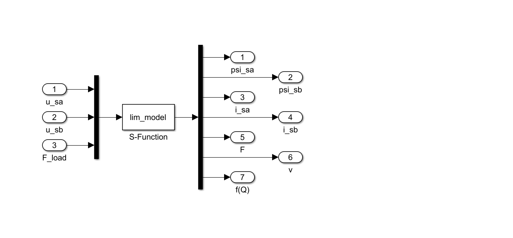
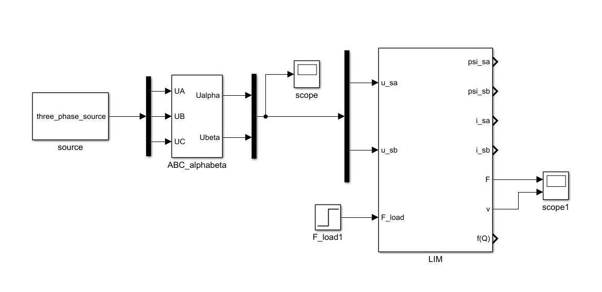

# Linear-Induction-Motor-Model
*A LIM simulation model using MATLAB/S-Function.*

The model is established with single sided LIM mathmatical model. The mathmatical model is given below.

votage equation:

(i_{s\alpha}&plus;i_{r\alpha})&plus;\dot{\psi_{s\alpha}})
(i_{s\beta}&plus;i_{r\beta})&plus;\dot{\psi_{s\beta}})
(i_{s\alpha}&plus;i_{r\alpha})&plus;\dot{\psi_{r\alpha}}&plus;\omega_r\psi_{r\beta} )
(i_{s\beta}&plus;i_{r\beta})&plus;\dot{\psi_{r\beta}}-\omega_r\psi_{r\alpha} )

flux equation:

(i_{s\alpha}&plus;i_{r\alpha}))
(i_{s\beta}&plus;i_{r\beta}))
(i_{s\alpha}&plus;i_{r\alpha}))
(i_{s\beta}&plus;i_{r\beta}))

and the movement equation:

/\tau)

from the votage equation, we got the current equation:

from the flux equation, we got the flux state equation:

(i_{s\alpha}&plus;i_{r\alpha}))
(i_{s\beta}&plus;i_{r\beta}))
(i_{s\alpha}&plus;i_{r\alpha})&plus;\omega_r\psi_{r\beta})
(i_{s\beta}&plus;i_{r\beta})&plus;\omega_r\psi_{r\alpha})

the S-Function model writted as `lim_model.m`.

the simulink model is `lim_s_function.slx`.

then the LIM S-Funtion model looks like this:

the open-loop simulation:

 

The parameters of LIM is listed below.

| parameter | value | unit  |
| :-------: | :---: | :---: |
| Rs        | 1.25  | ohm   |
| Rr        | 2.7   | ohm   |
| Lr        | 40.1  | mH    |
| Ls        | 33.1  | mH    |
| Lm        | 32.6  | mH    |
| m         | 8     | kg    |
| D         | 0.286 | m     |
| tau       | 0.066 | m     |
| p         | 4     | none  |

you can change the parameters to yours.

